<h1 align="center">SpaceShooter Game 🚀</h1>

Link para acesso

Itch.io: https://jontah.itch.io/spaceshooter 

<h2 align="center">Sobre o jogo 🚀</h2>

O jogo é um projeto acadêmico, desenvolvido utilizando das ferramentas disponíveis na versão gratuita do Construct 3, uma plataforma online de desenvolvimento, programação e publicação de jogos 2D. Utiliza ainda do banco de dados do Firebase para armazenamento de pontuações.

<h2 align="center">Como jogar 🚀</h2>

Movimente e atire com sua nave. Seja ágil! Não permita que as naves inimigas cheguem até você. Destrua-as.
 Utilize as setas direcionais do teclado para se mover, o botão esquerdo do mouse para atirar e, quando carregado, use o botão direito para ativar seu escudo e se proteger contras as ameaças. 

<h2 align="center">Firebase 🚀</h2>

Integrado ao Firebase, o jogo utiliza dos recursos de armazenamento e sincronização de dados em tempo real para coletar a pontuação do jogador, possibilitando o registro com seu nome no Ranking de pontuações. O envio e recebimento é feito através da função AJAX do próprio Construct, que permite ao jogo solicitar, bem como, enviar informações para outras páginas da web.

<h2 align="center">Assets/Sprites 🚀</h2>

Mostre suas habilidades de programação com estilo! Utilize nossos ícones de linguagens para destacar as tecnologias envolvidas em seus projetos. Esses ícones são amplamente reconhecidos pela comunidade de desenvolvedores e adicionam um toque especial ao seu README.

<h2 align="center">Prints 🚀</h2>

Este é um projeto de código aberto e adoraríamos receber contribuições da comunidade de desenvolvedores! Sinta-se à vontade para fazer fork deste repositório, trabalhar em melhorias e enviar pull requests para análise.

<h3 align="center">Jogo</h3>
  

   <Table>
      <tr>
        <td>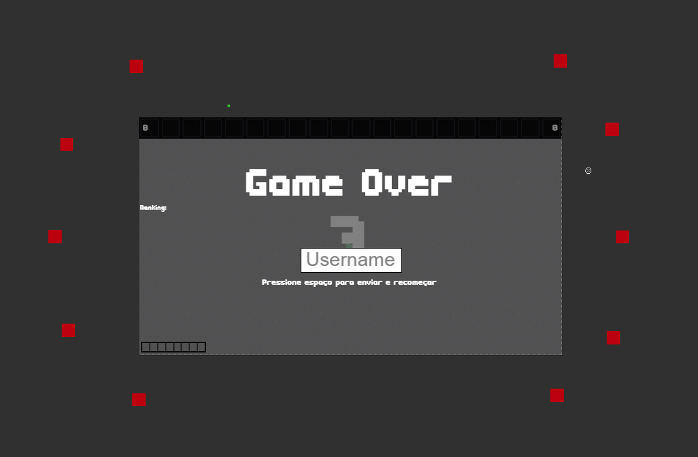</td>
        <td>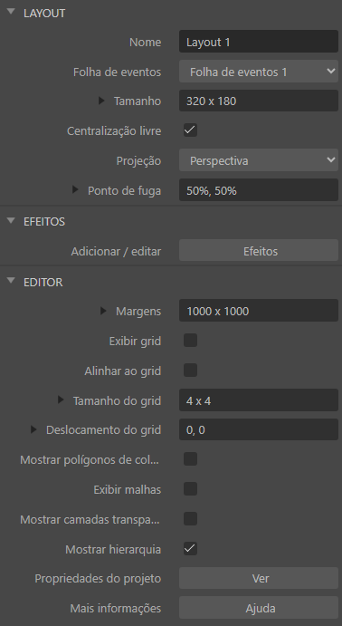
      </tr>
      <tr align="center">
        <td>Layout Principal</td>
        <td>Propriedades</td>
      </tr>
  </Table>
  <Table>
      <tr>
        <td>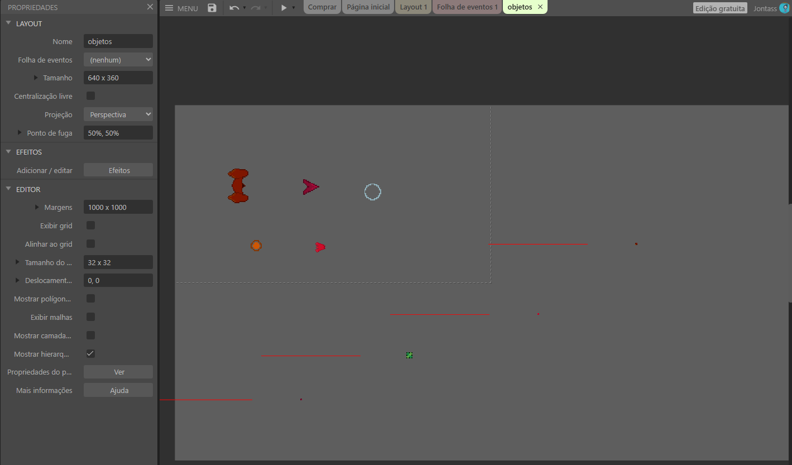</td>
        <td>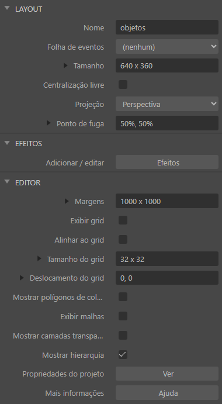
      </tr>
      <tr align="center">
        <td>Layout Secundário</td>
        <td>Propriedades</td>
      </tr>
  </Table>
  <Table>
    <tr>
      <td>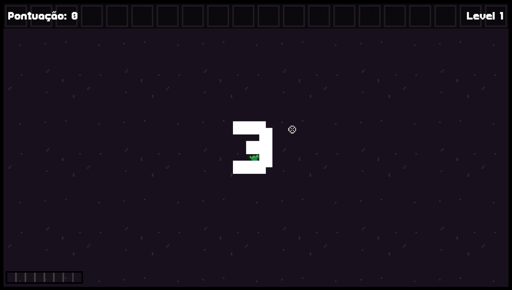</td>
      <td></td>
    </tr>
    <tr align="center">
      <td>Tela de Início</td>
      <td>Tela de GameOver</td>
    </tr>
  </Table>
  <Table>
    <tr>
      <td>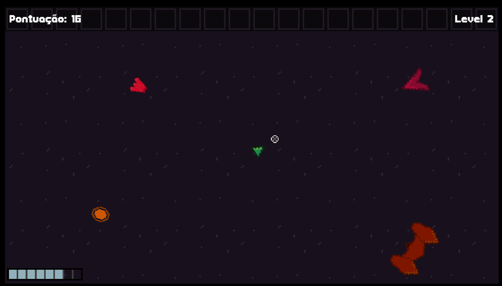</td>
      <td>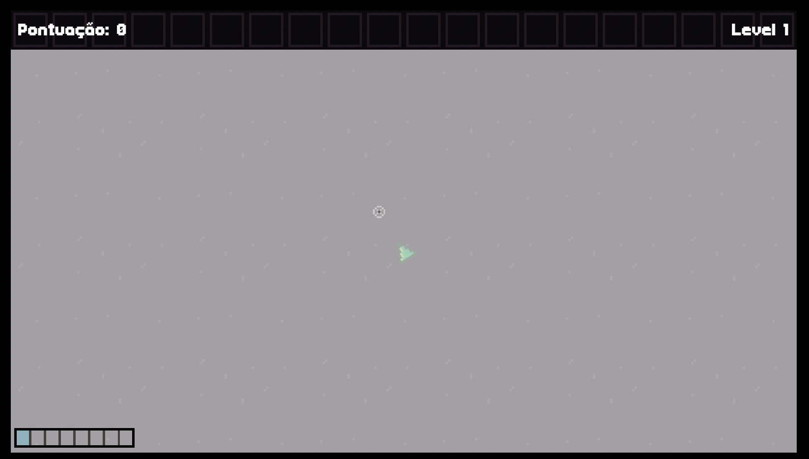</td>
      <td>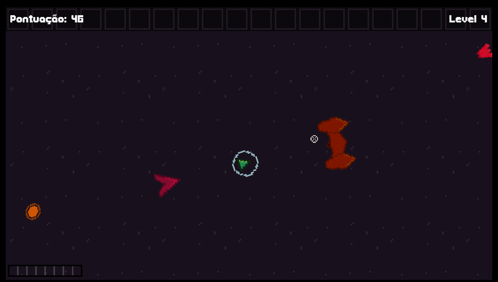</td>
    </tr>
    <tr align="center">
      <td>inGame</td>
      <td>Flash Ativado</td>
      <td>Escudo Ativado</td>
    </tr>
  </Table>
  <table>
    <tr><td>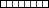</td></tr>
    <tr align="center"><td>Barra do escudo</td></tr>
  </table>
  <Table>
    <tr><th colspan="2">Folha de Eventos</th></tr>
    <tr>
      <td>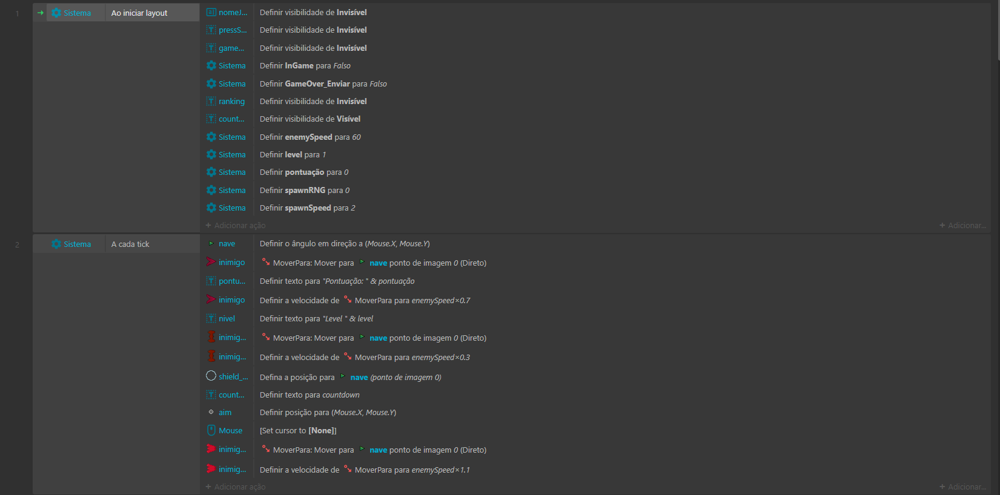</td>
      <td>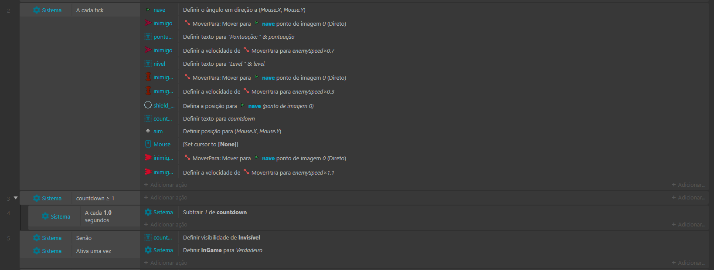</td>
    </tr>
    <tr>
      <td>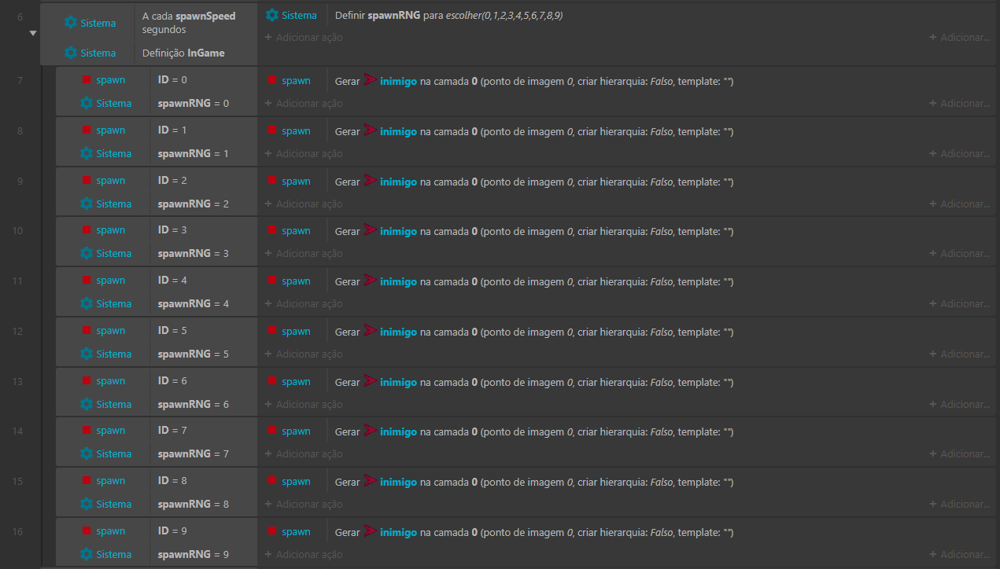</td>
      <td>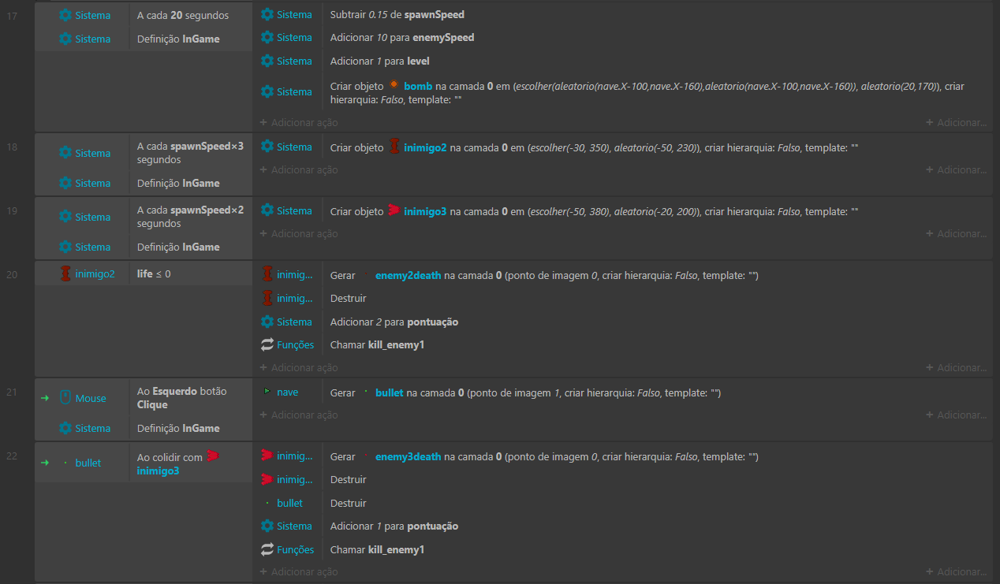</td>
    </tr>
    <tr>
      <td>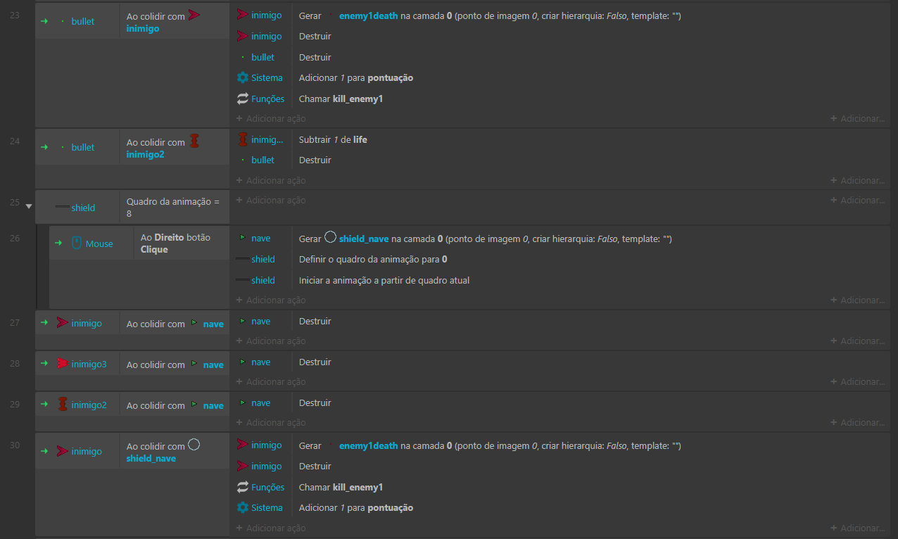</td>
      <td>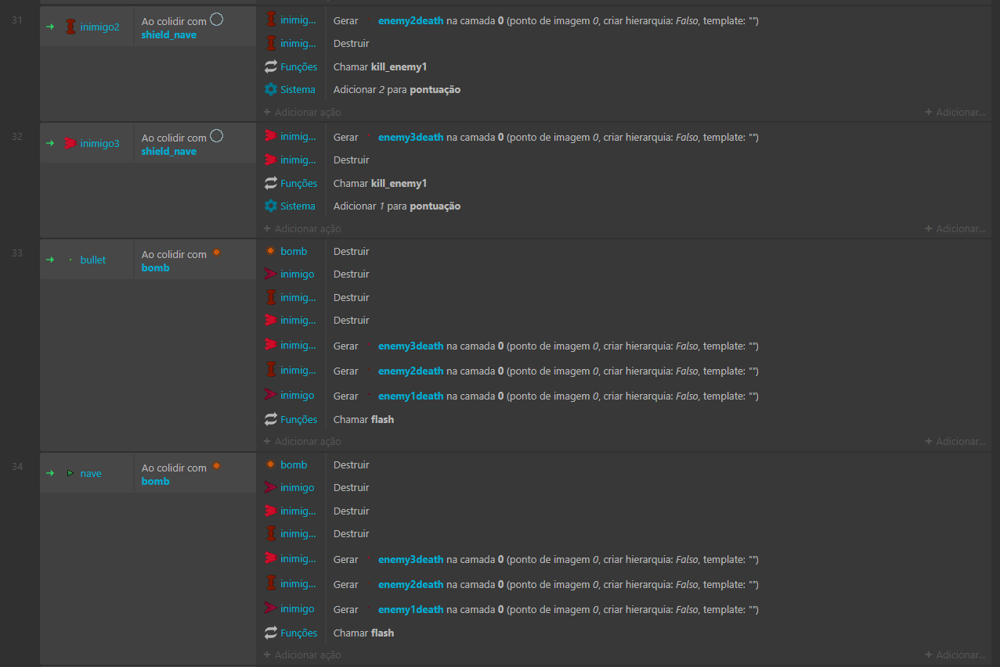</td>
    </tr>
    <tr>
      <td>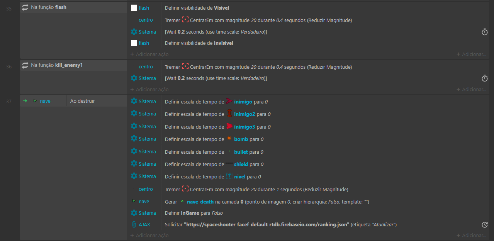</td>
      <td>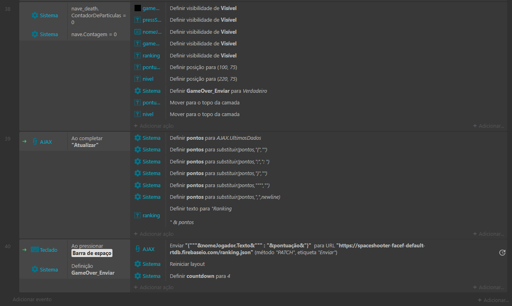</td>
    </tr>
    <tr align="center"><td colspan="2">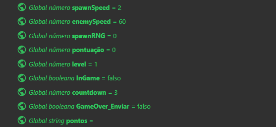</td></tr>
    <tr align="center"><td colspan="2">Variáveis</td></tr>
  </Table>

<h3 align="center">Banco de dados</h3>

  <table>
    <tr><td>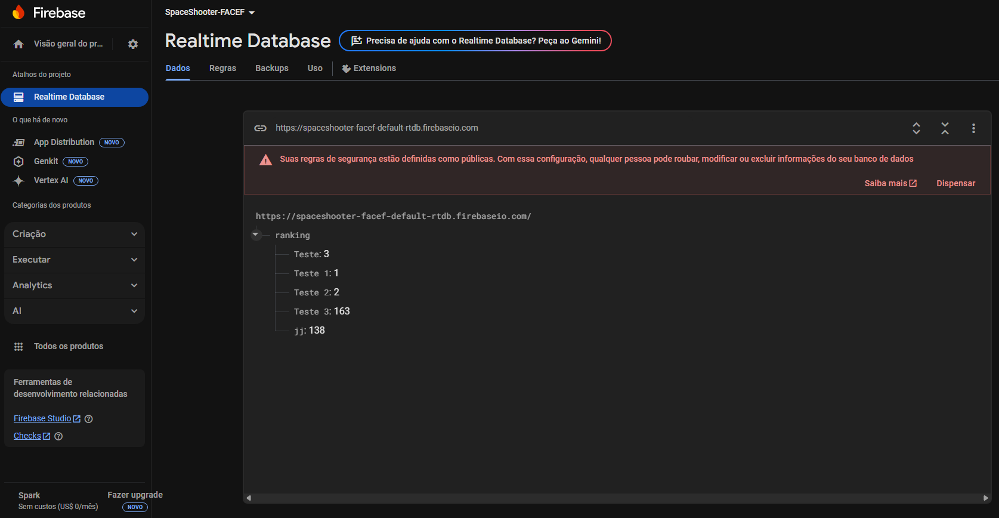</td></tr>
    <tr align="center"><td>BD Firebase</td></tr>
  </table>
  <table>
    <tr><td>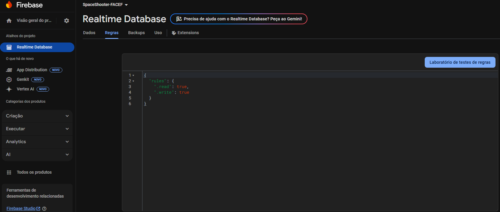</td></tr>
    <tr align="center"><td>Regras</td></tr>
  </table>

