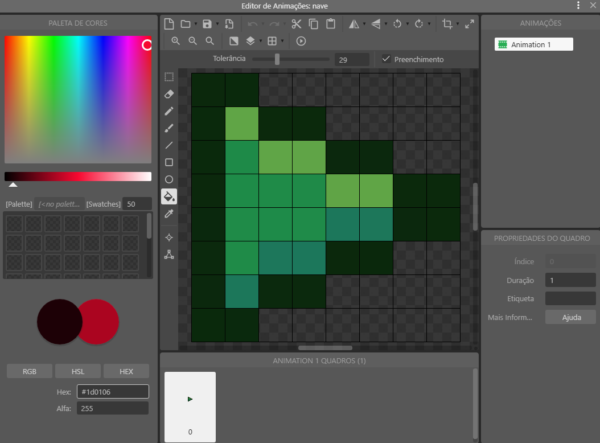
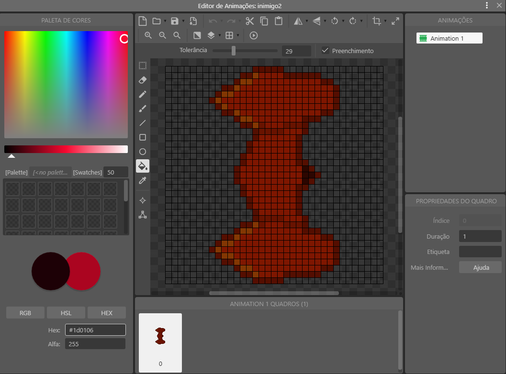
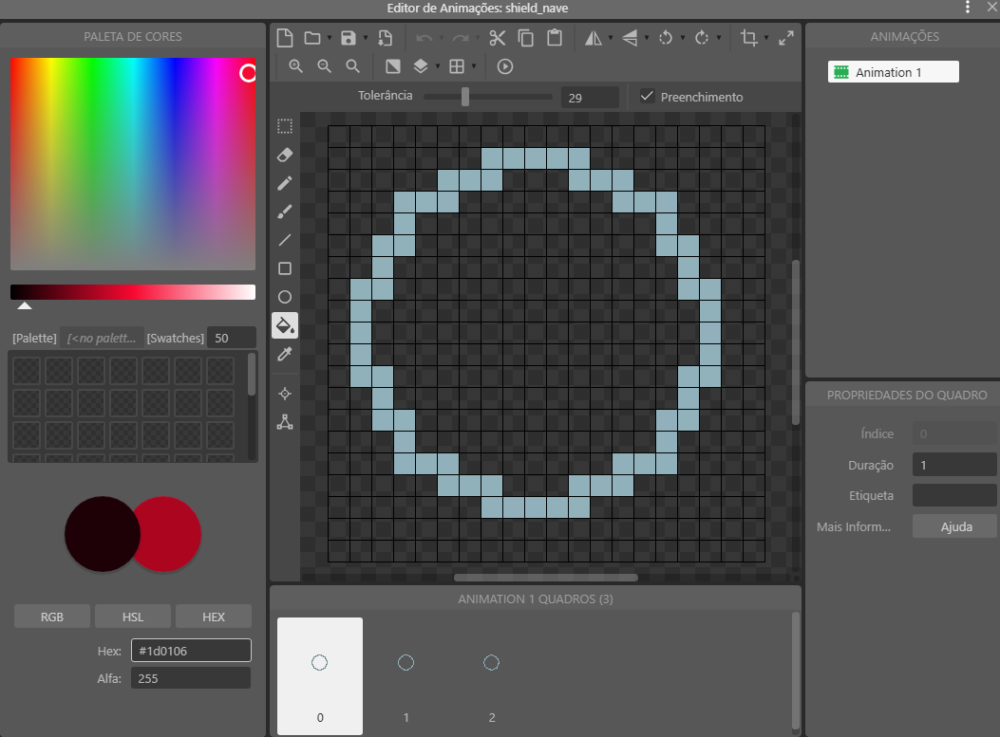

<h1 align="center">SpaceShooter Game 🚀</h1>

Link para acesso

Itch.io: https://jontah.itch.io/spaceshooter 

<h2 align="center">Como jogar 🚀</h2>

Movimente e atire com sua nave. Seja ágil! Não permita que as naves inimigas cheguem até você. Destrua-as.
 Mova-se através das setas direcionais e utilize o mouse para atirar e ativar seu escudo.  

<h2 align="center">Sobre o jogo 🚀</h2>

O jogo é um projeto acadêmico desenvolvido para o 1° Semestre de Sistemas de Informação no Uni-FACEF. Foram utilizadas as ferramentas disponíveis na versão gratuita do Construct 3, uma plataforma online de desenvolvimento, programação e publicação de jogos 2D. O objetivo do jogo é simples: sobreviver o máximo possível sem que os inimigos cheguem até você. Devido as limitações da plataforma, a ideia era criar algo não muito elaborado e ao mesmo tempo divertido, que tivesse um sistema capaz de contabilizar a pontuação do jogador a fim de salvá-la no Banco de Dados do Firebase, que também faz parte do projeto. 
Está publicado no site do Itch.io para que qualquer um jogue. Pode ser acessado clicando <a aqui.

<h2 align="center">Efeitos e funções</h2>

A fim de tornar a gameplay mais dinâmica e divertida, foram adicionadas ao jogo algumas funcionalidades e efeitos como:

  <ul>
    <li>Spawn exponencial e aleatório de naves</li>
    <li>Naves destruídas explodem gerando partículas e causando um tremor na tela</li>
    <li>Surgimento ocasional de orbes pela tela que, quando atingidos, causarão um flash e destruírão todos os inimigos</li>
    <li>Naves inimigas possuem atributos diferentes, sendo a maior delas mais resistente e a menor mais rápida, movimentando-se de forma única</li>
    <li>Um escudo pessoal se carrega ao durante o jogo, que pode ser ativado protegendo o jogador</li>
  </ul>

<h2 align="center">Firebase 🚀</h2>

Integrado ao Firebase, o jogo utiliza dos recursos de armazenamento e sincronização de dados em tempo real para coletar a pontuação do jogador, possibilitando o registro com seu nome no Ranking de pontuações. O envio e recebimento é feito através da função AJAX disponível no Construct, que permite ao jogo solicitar e enviar informações para outras páginas da web.

<h2 align="center">Assets/Sprites 🚀</h2>

Durante o desenvolvimento do projeto, foram utilizados diversos modelos para representação de naves, efeitos, partículas, cenário e HUD, todos esses feitos à mão.
 Alguns deles: 

<table>
  <tr>
    <td></td>
    <td></td>
    <td></td>
  </tr>
  <tr>
    <td></td>
    <td></td>
    <td></td>
  </tr>
</table>

<h2 align="center">Prints 🚀</h2>

Abaixo estão algumas imagens que mostram um pouco sobre o desenvolvimento e funcionamento do jogo, além também do Banco de dados e sua configuração.

<h3 align="center">Jogo</h3>
  

   <Table>
      <tr>
        <td></td>
        <td>
      </tr>
      <tr align="center">
        <td>Layout Principal</td>
        <td>Propriedades</td>
      </tr>
  </Table>
  <Table>
      <tr>
        <td></td>
        <td>
      </tr>
      <tr align="center">
        <td>Layout Secundário</td>
        <td>Propriedades</td>
      </tr>
  </Table>
  <Table>
    <tr>
      <td></td>
      <td></td>
    </tr>
    <tr align="center">
      <td>Tela de Início</td>
      <td>Tela de GameOver</td>
    </tr>
  </Table>
  <Table>
    <tr>
      <td></td>
      <td></td>
      <td></td>
    </tr>
    <tr align="center">
      <td>inGame</td>
      <td>Flash Ativado</td>
      <td>Escudo Ativado</td>
    </tr>
  </Table>
  <table>
    <tr><td></td></tr>
    <tr align="center"><td>Barra do escudo</td></tr>
  </table>
  <Table>
    <tr><th colspan="2">Folha de Eventos</th></tr>
    <tr>
      <td></td>
      <td></td>
    </tr>
    <tr>
      <td></td>
      <td></td>
    </tr>
    <tr>
      <td></td>
      <td></td>
    </tr>
    <tr>
      <td></td>
      <td></td>
    </tr>
    <tr align="center"><td colspan="2"></td></tr>
    <tr align="center"><td colspan="2">Variáveis</td></tr>
  </Table>

<h3 align="center">Banco de dados</h3>

  <table>
    <tr><td></td></tr>
    <tr align="center"><td>BD Firebase</td></tr>
  </table>
  <table>
    <tr><td></td></tr>
    <tr align="center"><td>Regras</td></tr>
  </table>

